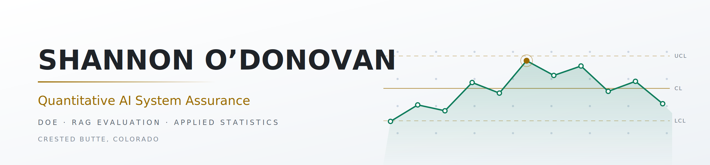

  

<h1 align="center">Shannon O'Donovan</h1>

  <b>I answer AI's hardest question: can we trust this system's output in production?</b> 
  Quantitative AI System Assurance 
  Boulder, Colorado

<!-- Row 1: Core languages & data -->

  
  
  
  
  

<!-- Row 2: AI / RAG engineering -->

  
  
  
  
  

<!-- Row 3: Retrieval & evaluation -->

  
  
  
  
  

<!-- Row 4: Experimental design & ML -->

  
  
  
  
  

  
  

---

## The short version

Twenty years of enterprise architecture, Six Sigma, and decision-support delivery across finance, operations, and technology — now applied to the hardest problem in production AI: knowing whether to trust the output. I architect and evaluate LLM-based systems with the same rigor I've applied to SQL Server migrations, contact center transformations, and ML model production releases.

My background spans finance, IT, and operations, where I have used statistical process control, design of experiments, and data-driven evaluation methods to improve system reliability and decision quality. I specialize in testing RAG and agentic AI workflows, focusing on grounding fidelity, retrieval effectiveness, and measurable performance against defined objectives. I believe trustworthy AI is built through rigorous evaluation, not just model capability.

---

## Featured work

<table>
<tr>
<td width="33%" valign="top">

### RAG Agent Evaluation Framework
**[RAG_DOE-GroundedAgentLab →](https://github.com/CoDataGuy/RAG_DOE-GroundedAgentLab)**

A nine-phase build of a retrieval-grounded teaching agent and the statistical
framework used to evaluate it. Covers randomized complete block design, fractional
factorial studies, LLM-as-judge batch scoring, and scorer validation via Cohen's
Kappa.

**Result worth reading:** temperature (0.3–0.8) showed no statistically significant
effect on Rule Grounding Score. A null result — and a useful one, because it means
retrieval design absorbed the sampling variability.

`RCBD` `ANOVA` `LLM-as-Judge` `MSA` `Prompt caching`

</td>
<td width="33%" valign="top">

### Catching AI getting statistics wrong
**[Google-AI →](https://github.com/CoDataGuy/Google-AI)**

Evaluated Gemini 1.5 Pro as an LLM-based agent supporting data science workflows,
with a focus on statistical correctness, hallucination risk, and analytical failure
modes. Designed and implemented AI-assisted analysis workflows in Python using the
Gemini API with tool and function calling, and benchmarked outputs against a fully
manual, non-AI baseline built with NumPy, SciPy, Matplotlib, and Seaborn. The
evaluation surfaced systematic weaknesses in agent-driven statistical reasoning,
demonstrating where explicit constraints, baseline comparisons, and human judgment
remain essential.

**Result worth reading:** the agent selected wrong statistical tests, generated
hallucinated intermediate steps, and framed the analytical problem incorrectly —
while producing output that read as fluent, confident, and complete. A reviewer
without a baseline would not have caught it.

`Manual baseline design` `Failure-mode analysis` `Human-in-the-loop` `Gemini API` `SciPy`

</td>
<td width="33%" valign="top">

### Who is the F1 GOAT, statistically?
**[Formula1 →](https://github.com/CoDataGuy/Formula1)**

Formula 1's points system has changed dramatically since 1950, transforming the
value of a race weekend from a maximum of 9 points to as many as 34. This evolving
scoring scale introduces a time-dependent measurement bias, making raw point totals
inherently favor more recent teams and preventing meaningful comparisons across eras.

This project normalizes historical Formula 1 results using a standardized scoring
framework and evaluates how conclusions change when the measurement system is
controlled. Perceived all-time rankings are highly sensitive to scoring methodology.

**Result worth reading:** rescoring every Grand Prix on a standardized scale moves
Red Bull's raw total of 7,673 points to 4,072, while Williams rises from 3,641 to
4,834. The "greatest of all time" debate is ultimately a question of measurement
validity.

`pandas` `NumPy` `Normalization` `Exploratory analysis`

</td>
</tr>
</table>

---

<b>Toolbox</b> — click to expand

 

| Area | What I use |
|---|---|
| Languages | Python, T-SQL, some PL/SQL |
| Data | pandas, NumPy, SciPy, Matplotlib, Seaborn, Jupyter, SQL Server / SSIS / BIDS |
| ML | scikit-learn — random forest, decision trees; unsupervised clustering |
| AI providers | Anthropic Claude API, Google Gemini / Vertex AI, Voyage AI embeddings, text-embedding-004 |
| RAG & retrieval | Hybrid retrieval (BM25 + vector + RRF), contextual retrieval, Vertex AI Vector Search, LangChain, agentic tool use, prompt caching, context window optimization |
| Evaluation | LLM-as-judge, gated composite metrics, Cohen's Kappa, measurement system analysis |
| Experimental design | RCBD, factorial DOE, response-surface methods, ANOVA with blocking, MSA |
| Tools | JMP, Kaggle Notebooks, Google Colab, Git |

<b>Background</b> — click to expand

 

Twenty years of enterprise architecture, Six Sigma, and decision-support delivery across finance, operations, and technology — now applied to the hardest problem in production AI: knowing whether to trust the output. I architect and evaluate LLM-based systems with the same rigor I've applied to SQL Server migrations, contact center transformations, and ML model production releases.

---

  Reach me via <a href="mailto:shannon.ods@gmail.com">email</a> or <a href="https://www.linkedin.com/in/shannon-o-donovan-276a804/">LinkedIn</a>.

